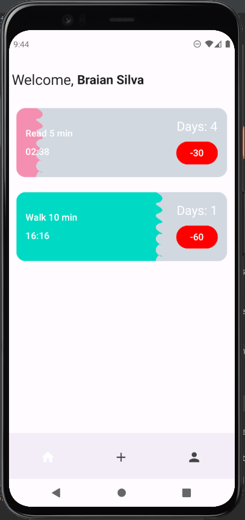

# HabitsRe

A simple habit tracker that helps you decrease your progress each time you fail, keeping you motivated to improve every day.

## Getting Started

Follow these steps to set up and run the project on your machine:

1. **Create a Firebase Account**:
   - Sign up at [Firebase](https://firebase.google.com/), create a new project, and download the `google-services.json` file.
2. **Add Configuration Files**:
   - Place the `google-services.json` file in the `app` folder of your project.
3. **Set Up API Authentication**:
   - Add your API keys to a file named `env.properties` in the root of your project. Ensure it contains:
     ```
     WEB_CLIENT_ID=your_code_goes_here
     ```
   - Include any necessary credentials and authentication details.

### Prerequisites

Before you begin, make sure you have the following installed:

* **Java Development Kit (JDK)** - Required to build and run Android projects.
* **Android Studio** - The official IDE for Android development (you can use the free version).
* **Firebase Account** - A Google account to use Firebase services, including `google-services.json` for database and authentication.

### Installing

To get the app running on your local machine:

1. **Fork the repository** from GitHub.
2. **Clone the repository** to your local machine:
   ```bash
   git clone https://github.com/your-username/HabitsRe.git
   ```
3. **Open the project** in Android Studio.
4. **Build and run** the app on an emulator or a physical device.

## Built With

* [Firebase Realtime Database](https://firebase.google.com/docs/database) - Used for storing data and providing real-time updates.
* [AndroidX](https://developer.android.com/jetpack/androidx) - Jetpack Compose and other Android libraries for UI and app functionality.
* [Hilt](https://dagger.dev/hilt/) - Dependency injection for Android.
* [Coil](https://coil-kt.github.io/coil/) - Image loading library for Android.
* [JUnit](https://junit.org/junit4/) - Testing framework for unit tests.
* [Espresso](https://developer.android.com/training/testing/espresso) - Framework for UI testing.

## Contributing

We welcome contributions! Follow these steps to contribute:

1. **Fork the repository** on GitHub.
2. **Clone your forked repository**:
   ```bash
   git clone https://github.com/your-username/HabitsRe.git
   ```
3. **Navigate to the repository directory**:
   ```bash
   cd HabitsRe
   ```
4. **Create a new branch** for your feature or bug fix:
   ```bash
   git checkout -b feature/your-feature-name
   ```
5. **Make your changes** (edit files, add features, fix bugs, etc.).
6. **Stage the changes**:
   ```bash
   git add .
   ```
7. **Commit your changes** with a descriptive message:
   ```bash
   git commit -m "Description of your changes"
   ```
8. **Push the changes** to your forked repository:
   ```bash
   git push origin feature/your-feature-name
   ```
9. **Submit a pull request**:
   - Open your forked repository on GitHub.
   - Click on "Compare & pull request".
   - Add a description and submit the pull request.

## Screenshots



## Authors

* **Braian Silva** - [GitHub](https://github.com/BraianS)

## License

This project is licensed under the MIT License - see the [LICENSE.md](LICENSE.md) file for details.
